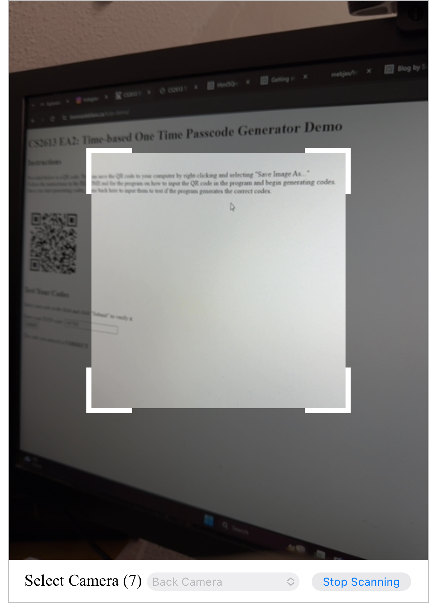

# About the library

## The library used

The library used for this project is html5-qrcode.

## What is html5-qrcode

html5-qrcode allows for you to embed a QR code reader within your website, with all processing being done on the client side. You can either use the included UI or you can design your own using the library. In the case of designing your own UI, the library provides many functions to scan (by either file input or through the user's camera) and decode QR codes as well as many types of barcodes [4].

To use the library, you need to either store the library locally or include `<script src="https://unpkg.com/html5-qrcode" type="text/javascript">` in the header portion of your HTML code [1]. In your JavaScript code, instantiating one of two objects: `Html5Qrcode` or `Html5QrcodeScanner`

`Html5Qrcode` is the class you use when you want to design your own UI for the scanner but still want to use the scanning and decoding capabilities of the library.

`Html5QrcodeScanner` is the class you use when you want a fully working UI right out of the box.

Each class contains their own set of methods when it comes to scanning and decoding QR codes and barcodes.

## Functionalities

As described, there are two main functionalities: A pre-made UI and design your own UI. While the fundamentals are the same between both options, we will focus more on the pre-made UI.

Before we create an object, there are two functions that we must create: `onScanSuccess()` and `onScanFailure()`.

`onScanSuccess()` is the logic for when a valid QR code or barcode is scanned. It accepts two arguments: `decodedText`, which is the message stored in the QR code or barcode, and `decodedResult`, which is a struct containing the decoded data again as well as what code format it was. This can also close the UI once finished, which is what was done in our configuration [1][2].

`onScanFailure()` is the logic for when an invalid QR or barcode is scanned. It accepts one argument, `error`, which contains data on the error that was thrown. The documentation that only a warning is thrown to the console as it will allow for the program to continue scanning for a barcode [1].

Also, your HTML code should contain a `<div>` with a set ID of your choosing as well as a maximum width. This is what the library will use to display the UI.

Once these functions are created, we can create a `Html5QrcodeScanner` object.

The constructor takes in three arguments: `elementId`, `config`, and `verbose` [2].

`elementId` takes in the ID of the `<div>` you wish to use for the UI [2].

`config` takes in config data for the UI, which is described in the API documentation [1]. For our specific configuration, we followed the defaults in the documentation.
These were:
```javascript
{fps: 10, qrbox: {width: 250, height: 250}}
```
FPS sets the frames per second we want our camera to scan at. A higher value will result in faster scanning, but too high can cause performance issues.
qrbox limits the view finder window for the camera when scanning [4].

`verbose` takes in a boolean and toggles whether to print all logs to the console or not. For our configuration, we set it to `false` [4].

After the object is created, we render the window by invoking the `render()` method, which takes in our `onScanSuccess()` funcation and our `onScanFailure()` function.

### Example Code + Output
#### Code
```javascript
function onScanSuccess(decodedText, decodedResult) {
    let codes = decodedText.split(",");
    try {
        key = codes[0];
        t_0 = Number(codes[1]);
        html5QrcodeScanner.clear();
        document.getElementById("qr-result").innerHTML = "Successfully read the QR code! Please proceed to Step 2.";
    } catch (err) {
        console.warn("Code read error = " + err);
        document.getElementById("qr-result").innerHTML = "Error reading code. Did you scan the right code?";
    }
}

function onScanFailure(error) {
    console.warn("Code scan error = " + error);
}

function readQR() {
    html5QrcodeScanner = new Html5QrcodeScanner(
        "reader",
        {fps: 10, qrbox: {width: 250, height: 250}},
        /* verbose= */ false);
    html5QrcodeScanner.render(onScanSuccess, onScanFailure);
}
```
#### Output

Image taken on Desktop of file input



## When was html5-qrcode created

The first version of html5-qrcode was released on April 4, 2020 [3].

## Reason for selection

This library was selected as QR codes are a good example on how TOTP secrets are given to the user. Most websites, when selecting this type of 2FA, display to the user a QR code which they can scan in their authenticator app. To gain a full appretiation of this security method, as well as ease of communicating the key and T<sub>0</sub> used in this program, a QR code system only made sense. This library in specific was chosen due to it being easy to install (since only an HTML tag is needed, which also saves on storage space) and being easy to use since it includes the pre-made UI.

## Influence on learning the language

This library, for me, reenforced the idea of passing functions as arguments in JavaScript (in the case of the `render()` method) as well as passing structs (in the case of the `config` argument). It also reenforced Object-Oriented Programming since the scanner acted as a JavaScript object.

## Overall Experience

The overall experience with this library was pleasant. It was very easy to use and caused no issue during the development of this program. 
For its ease of use and simplicity, I would recommend this library to anyone. I would also continue to use this package since it's easy to drop into a program/website and is also allows for a cutomizable UI.

## References

[1] https://scanapp.org/html5-qrcode-docs/docs/intro
[2] https://scanapp.org/html5-qrcode-docs/docs/apis/classes/Html5QrcodeScanner
[3] https://github.com/mebjas/html5-qrcode/releases/tag/v1.0.0
[4] https://github.com/mebjas/html5-qrcode