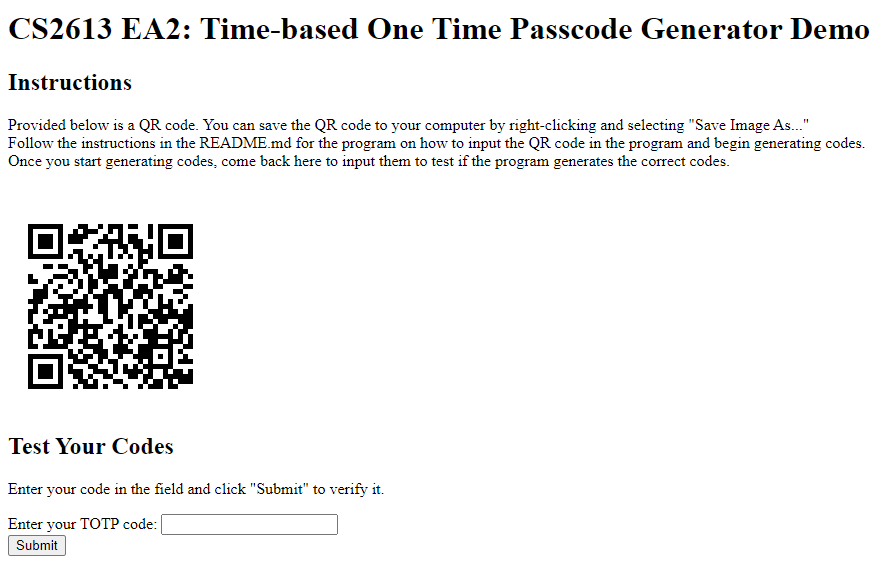

[](https://classroom.github.com/a/RPDAFNpj)
# Time-based One Time Passcode Generator

This program allows you to generate Time-based One Time Passcodes (or TOTP codes for short). These are primarily used for Two Factor Authentication (2FA) when logging in to online services. The use of TOTP codes as a 2FA method increases account security greatly as these codes are extremely hard to crack without knowing the secret key, which are securely stored on the server and client. The purpose of this program is to demonstrate the generation and verification transactions and reenforce the idea that TOTP is a secure 2FA method.

The library showcased in this program is [html5-qrcode](https://github.com/mebjas/html5-qrcode), which allows for a QR code reader to be embedded into a website and its values to be processed through JavaScript.

## How TOTP works

TOTP works by taking the HMAC-SHA-1 of the current time step, which is calculated by the following formula:

```math
T
=
\frac{T_c - T_0}{x}
```

Where T<sub>c</sub> is the current time in seconds since epoch, T<sub>0</sub> is initial time since starting generation, and x is the agreed period between time steps.
In general (and what is described in RFC6238), x is typically 30, meaning a new code is generated every 30 seconds. This is what is used in this program.
T<sub>0</sub>, in the context of this program, is predetermined and passed along in the QR code to ensure consistency. In the real world, this would be the time at which the QR code was entered into your authenticator app.

Once we have the HMAC-SHA-1, we can take the 4 most significant bytes, convert from HEX to decimal, then take the modulo of it with 10<sup>DIGIT</sup>, where DIGIT is how many digits you want (in our case, 6).

## More information on TOTP

This program is based off, and *should* be compliant with, [[RFC6238]](https://datatracker.ietf.org/doc/html/rfc6238) (describing the TOTP algorithm) and [[RFC4226]](https://datatracker.ietf.org/doc/html/rfc4226) (describing the HMAC-based One Time Passcode (HOTP) algorithm, which is the basis of the TOTP algorithm).

## Instructions

Use the following links to access each portion of the program:

[[TOTP-demo] - brennanleblanc.ca/totp-demo](https://brennanleblanc.ca/totp-demo)

[[TOTP-gen] - brennanleblanc.ca/totp-gen](https://brennanleblanc.ca/totp-gen)

This program is not meant to be run locally, though it can by running the HTML file in a web browser. This means that nothing has to be downloaded to your local machine.

The ideal configuration is for the TOTP-gen website to be run on a smartphone and the TOTP-demo website to be run on desktop, though both can be run on a desktop.

The TOTP-demo website contains a code checker as well as the QR code needed to start the generator.

The TOTP-gen website generates the codes. The instructions for which are as follows:

### Smartphone: Step 1

When using a smartphone, you can use the camera to scan the QR code. Click on "Read QR", allow access to the camera, and make sure you have the proper camera selected (you may have multiple options, but just pick between "Front Camera" and "Back Camera"). Once scanned, the window should disapear and give you a success message.

### Desktop: Step 1

First, follow the instructions on the TOTP-demo site to save the QR code to the computer. Next, click "Read QR" then "Scan an Image File". Navigate to where you saved the QR code and select it. Once scanned, the window should disapear and give you a success message.

### Both: Step 2

Click on "Generate Code" to generate a TOTP code. You can verify this code on the TOTP-demo site. Note that since the time step is set to 30, the codes are only valid for 30 seconds (though the website will accept a code from the previous time step/previous 30 seconds, as per the recommendation in RFC6238). If a code reads as not correct, simply generate a new code.

### TOTP Demo site

Codes can be entered onto this site in the provided text field. You MUST hit submit to process the code. Hitting Enter on the keyboard will refresh the page.

## Sample I/O

### Demo Website



The demo site provides the QR code to input into the generator as well as allows for users to input their codes to test the program.

Users enter their code into the field then click "Submit". Hitting enter will simply refresh the page.

### Generator Website


The generator website contains the QR code reader, which can either use a camera or take in a file, to read the provided QR code. This is started by pressing "Read QR". The code will be generated based on the time step at button press and will be displayed when the user clicks "Generate Code".

## Credits

The HMAC-SHA-1 algorithm is provided via the Gist by Seldaek: https://gist.github.com/Seldaek/1730205